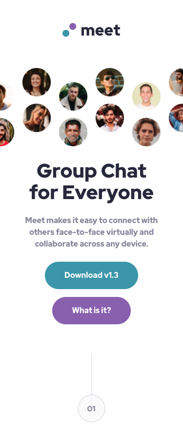
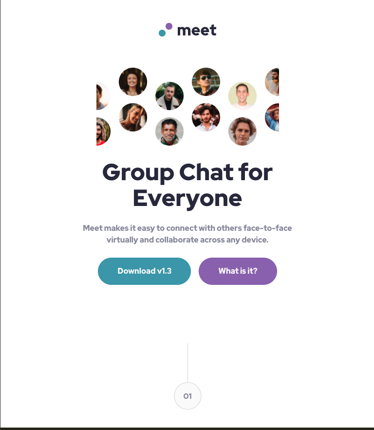

# Frontend Mentor - Meet landing page solution

This is a solution to the [Meet landing page challenge on Frontend Mentor](https://www.frontendmentor.io/challenges/meet-landing-page-rbTDS6OUR). Frontend Mentor challenges help you improve your coding skills by building realistic projects. 

## Table of contents

- [Overview](#overview)
  - [The challenge](#the-challenge)
  - [Screenshot](#screenshot)
  - [Links](#links)
- [My process](#my-process)
  - [Built with](#built-with)
  - [What I learned](#what-i-learned)
  - [Continued development](#continued-development)
- [Author](#author)

## Overview

### The challenge

Users should be able to:

- View the optimal layout depending on their device's screen size
- See hover states for interactive elements

### Screenshot
**Mobile**

**Tablet**

**Desktop**

### Links

- Solution URL: [Solution URL](https://github.com/ownedbyanonymous/meet-landing-page)
- Live Site URL: [Live site](https://your-live-site-url.com)

## My process

### Built with

- Semantic HTML5 markup
- CSS custom properties
- Flexbox
- CSS Grid
- Mobile-first workflow

### What I learned
Acquired knowledge on the following topics
- Design systems: utilizing design systems to deliver digital products that closely align with established high-fidelity designs and design guidelines.
- Responsive design: developed a better understanding of responsive design principles, enabling the creation of applications that adapt seamlessly across various screen sizes and devices.
- CSS Custom Properties: acquired knowledge in leveraging CSS custom properties to enhance code maintainability, reusability, and theming capabilities.

### Continued development

There still knowledge gaps in my understanding of responsive design especially regarding fonts and images
Use of the position CSS property. I still don't understand the difference between absolute and relative and when to use each of the values.

## Author

- Frontend Mentor - [@ownedbyanonymous](https://www.frontendmentor.io/profile/ownedbyanonymous)

